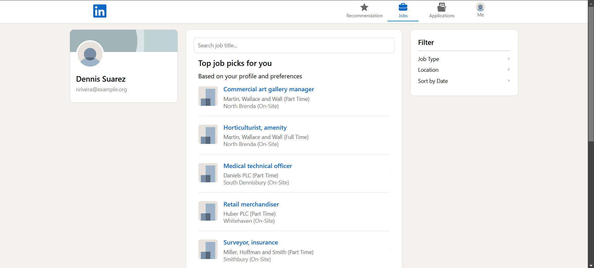
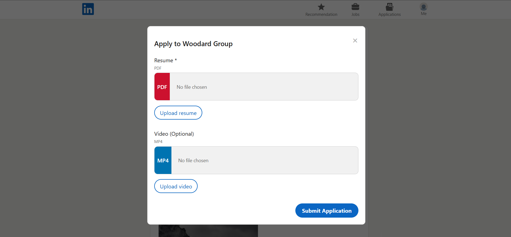
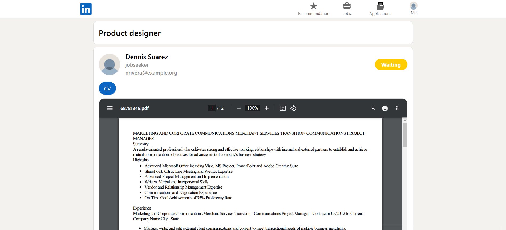
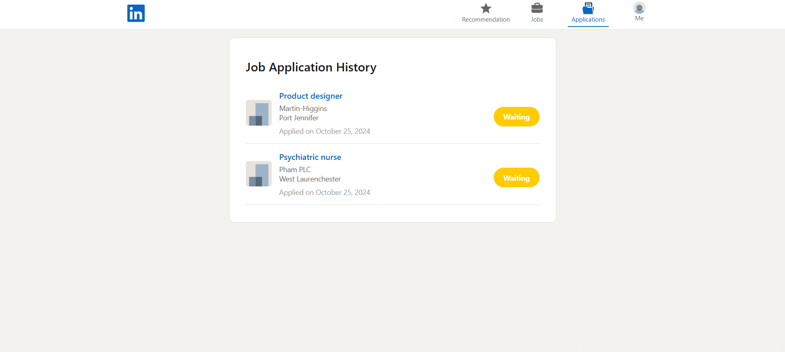
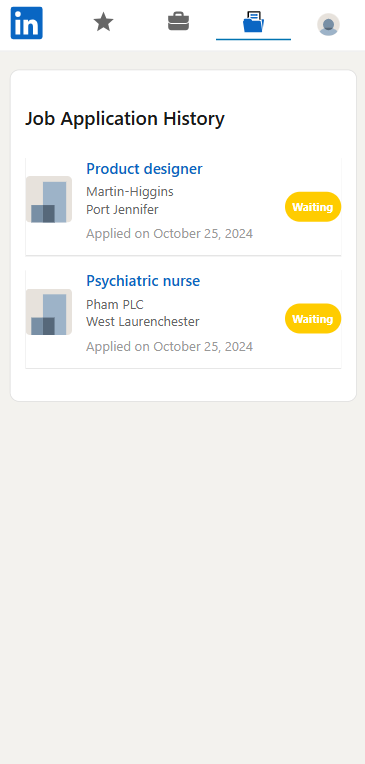
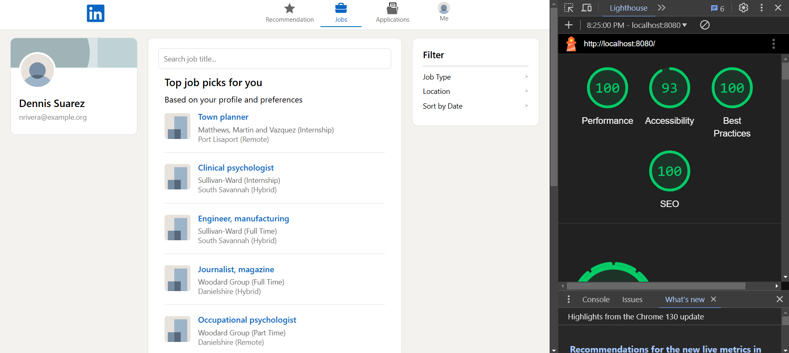
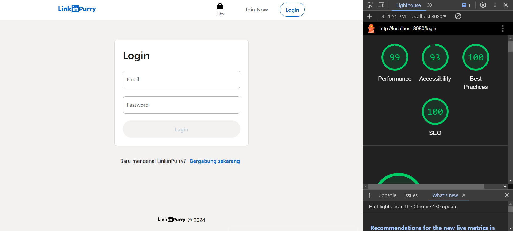
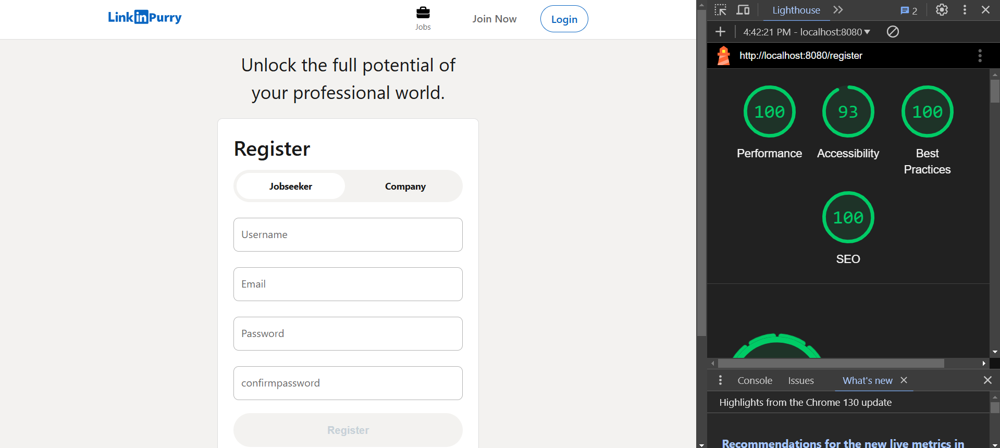
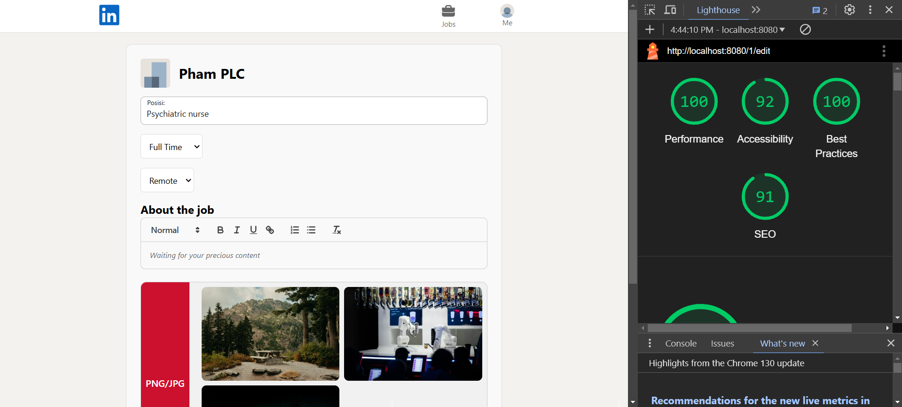

<h1 align="center" style="color: #FFFFFF"><em> Tugas Besar IF3110 - Pengembangan Aplikasi Berbasis Web </em></h1>

<br>
<h1 align="center" style="color: #FFFFFF"> Kelompok 06 </h1>

<div align="center">

| NIM        | Nama           |
| ---------------- | ----------------- |
| 13522064 | Devinzen |
| 13522074 | Muhammad Naufal Aulia |
| 13522084 | Dhafin Fawwaz Ikramullah |

</div>

## 📒 Table of Contents
* [Description](#📄-description)
* [Requirements](#❓-requirements)
* [Installation](#🔨-installation)
* [Server](#🔨-run-the-server)
* [Screenshots](#📷-screenshots)
* [Member's Jobdesc](#📄-members-job-description)
* [Completed Bonus](#✨-completed-bonus)

## 📄 Description
This is a web-based application that can be used for job search and recruitment. Users can register as a jobseeker to apply for jobs, or as a company to open job vacancies.
## ❓ Requirements
Before using this application, make sure you have Docker installed on your computer.
## 🔨 Installation
To install this application, simply clone this repository:
```bash
git clone https://github.com/Labpro-21/if3110-tubes-2024-k02-06
```
Navigating to the project directory:
```bash
cd ./if3110-tubes-2024-k02-06
```
Rename env.example file to env:
```bash
mv .env.example .env
```
## 🔨 Run the Server
Make sure Docker is installed and running on your machine. Then, run the following command to start the server:

```bash
docker-compose up
```

If you want to seed the database, you can run this command in the php image inside the docker container:
```bash
php scripts/seed.php
```
You can also navigate to the project directory and run the seed.bat file (for Windows)
```bash
./seed.bat
```
Or by running this command:
```bash
docker exec -it <CONTAINERNAME> sh -c "php scripts/seed.php"
```


Now, you can access the server at `http://localhost:8080`.

## 📷 Screenshots
### Login Page:
 

### Register Page:
 

### Guest Job Page:
 

### Home (Job Seeker) Page:
 

### Detail lowongan (Job Seeker) Page:
 
 

### Lamaran Page:
 

### Detail Lamaran (Job Seeker) Page:
 

### Riwayat Lamaran Page:
 

### Home (Company) Page:
 

### Tambah Lowongan Page:
 

### Detail Lowongan (Company) & Export CSV Page:
 

### Edit Lowongan Page:
 

### Detail Lamaran (Company) Page:
 

### Profile Page:
 
 

### Not Found Page:
 


## 📄 Member's Job Description
### Server-side
| Fitur                          | NIM      |
| ------------------------------ | -------- |
| Login                          | 13522084 |
| Register                       | 13522084 |
| Home (Jobseeker)               | 13522074 |
| Home (Company)                 | 13522064, 13522084 |
| Tambah Lowongan (Company)      | 13522084 |
| Detail Lowongan (Company)      | 13522064, 13522084 |
| Detail Lamaran (Company)       | 13522084 |
| Edit Lowongan (Company)        | 13522084 |
| Detail Lowongan (Jobseeker)    | 13522074 |
| Lamaran (Jobseeker)            | 13522074 |
| Riwayat (Jobseeker)            | 13522074 |
| Profil (Company)               | 13522084 |
| Autentikasi Pengguna           | 13522084 |
| Navigation Bar                 | 13522074, 13522084 |
| Filter Lowongan Pekerjaan      | 13522074, 13522064 |
| Sort Lowongan Pekerjaan        | 13522074, 13522064 |
| Pencarian Lowongan Pekerjaan   | 13522074, 13522064 |
| Melamar pekerjaan              | 13522074 |
| Penyimpanan file Binary        | 13522074, 13522084 |
| Pagination                     | 13522064 |
| Rich Text Editor               | 13522084 |
| Keamanan                       | 13522064, 13522074, 13522084 |
| Error handling                 | 13522084 |
| Responsivitas                  | 13522084 |
| Docker                         | 13522084 |
| All Responsive Web Design      | 13522074 |
| UI/UX Seperti Linkedin         | 13522074, 13522084 |
| Data Export                    | 13522084 |
| Simple Job Recommendation      | 13522084 |
| Google lighthouse              | 13522074, 13522084 |


### Client-side
| Fitur                          | NIM      |
| ------------------------------ | -------- |
| Login                          | 13522084 |
| Register                       | 13522084 |
| Home (Jobseeker)               | 13522074 |
| Home (Company)                 | 13522064, 13522084 |
| Tambah Lowongan (Company)      | 13522084 |
| Detail Lowongan (Company)      | 13522064, 13522084 |
| Detail Lamaran (Company)       | 13522084 |
| Edit Lowongan (Company)        | 13522084 |
| Detail Lowongan (Jobseeker)    | 13522074 |
| Lamaran (Jobseeker)            | 13522074 |
| Riwayat (Jobseeker)            | 13522074 |
| Profil (Company)               | 13522084 |
| Autentikasi Pengguna           | 13522084 |
| Navigation Bar                 | 13522074, 13522084 |
| Filter Lowongan Pekerjaan      | 13522074, 13522064 |
| Sort Lowongan Pekerjaan        | 13522074, 13522064 |
| Pencarian Lowongan Pekerjaan   | 13522074, 13522064 |
| Melamar pekerjaan              | 13522074 |
| Penyimpanan file Binary        | 13522074, 13522084 |
| Pagination                     | 13522074, 13522064 |
| Rich Text Editor               | 13522084 |
| Keamanan                       | 13522064, 13522074, 13522084 |
| Error handling                 | 13522084 |
| Responsivitas                  | 13522084 |
| Docker                         | 13522084 |
| All Responsive Web Design      | 13522074 |
| UI/UX Seperti Linkedin         | 13522074, 13522084 |
| Data Export                    | 13522084 |
| Simple Job Recommendation      | 13522084 |
| Google lighthouse              | 13522074, 13522084 |


## ✨ Completed Bonus
1. All Responsive Web Design
2. UI/UX seperti LinkedIn
3. Data Export
4. Google Lighthouse:







* Halaman edit lowongan sebelum:

* Halaman edit lowongan sesudah:

Skor lighthouse meningkat setelah dilakukan penambahan atribut alt pada tag img dan dilakukan peningkatan kontras antara warna teks dengan warna background. Perbaikan juga dilakukan dengan melengkapi deskripsi meta.

* Halaman detail lowongan (company) sebelum:

* Halaman detail lowongan (company) sesudah:

Skor lighthouse meningkat setelah dipastikan semua attachment gambar dalam tag img diberikan atribut alt.  Perbaikan juga dilakukan dengan melengkapi deskripsi meta.
